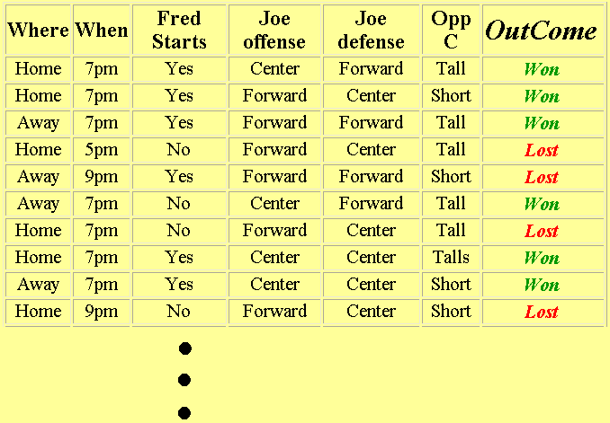

## CCS2424 Learning And Adaptive Systems

Using Entropy and Information Gain concepts, determine the most useful attribute for the analysis of the data below

Write a program to output the most useful attribute from the above table - Any language [20 marks]